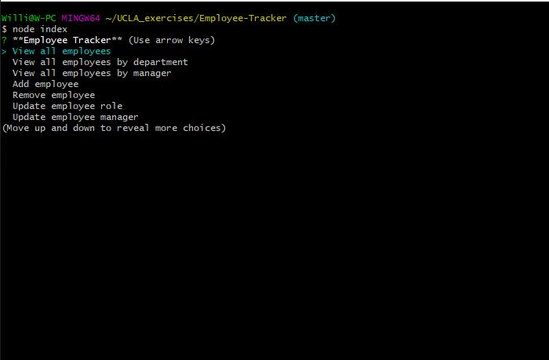
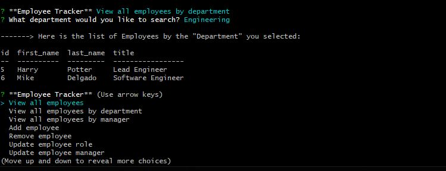
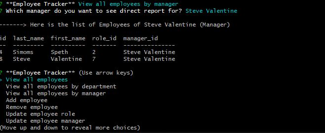

# 🏆 Employee Tracker App 🏆

##### **Badge:**

[](https://travis-ci.org/validatorjs/validator.js)

[](#sponsors)


## **Description:**
* Developers are often tasked with creating interfaces that make it easy for non-developers to view and interact with information stored in databases. Often these interfaces are known as Content Management Systems. this app was created as the solution for managing a company's employees using node, inquirer, and MySQL.

## **Table of Contents:**
1. [Installation](#installation)
2. [Usage](#usage)
3. [Contribution](#contribution)
4. [Questions](#questions)
5. [Link](#Link)
6. [Screenshots](#Screenshots)

## **Installation:**
* This app has utilized npm packages such as: 
```mysql```,
```inquirer```,
```Table``` 
Also, mysql workbench was required.

## **Usage:**
* This project will be used for facilitating a employee information database for any company.

## **Contribution:**
* Please if you come across this app, and would like to enhance... contact me.

### **Questions:**
* will@will.com

### **Link:**
* [GitHub] - https://github.com/williamsffc

## **Screenshots:**





-------------
© Copyright - 2020
